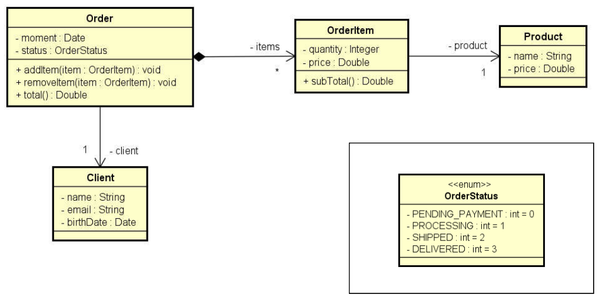

# Sistema de Pedidos (Order System)

## Descrição

Este projeto foi desenvolvido como solução para o exercício de fixação do Módulo 9: Enumerações e Composições, do curso de C# do professor Nélio Alves.

### Enunciado do Exercício

Ler os dados de um pedido com N itens (N fornecido pelo usuário). 
Depois, mostrar um sumário do pedido.

Nota: o instante do pedido deve ser o instante do sistema: `DateTime.Now`.

A resolução do professor para este exercício pode ser encontrada no repositório [composition3-csharp](https://github.com/acenelio/composition3-csharp).

## Diagrama de Classes



## Exemplo de Uso

### Entrada

```
Enter client data:
Name: Alex Green
Email: alex@gmail.com
Birth date (DD/MM/YYYY): 15/03/1985
Enter order data:
Status: Processing
How many items to this order? 2
Enter #1 item data:
Product name: TV
Product price: 1000.00
Quantity: 1
Enter #2 item data:
Product name: Mouse
Product price: 40.00
Quantity: 2
```

### Saída

```
ORDER SUMMARY:
Order moment: 20/04/2024 15:30:55
Order status: Processing
Client: Alex Green (15/03/1985) - alex@gmail.com
Order items:
TV, $1000.00, Quantity: 1, Subtotal: $1000.00
Mouse, $40.00, Quantity: 2, Subtotal: $80.00
Total price: $1080.00
```

## Como Rodar o Projeto

1.  **Clone o repositório (se aplicável):**
  ```bash
  git clone <url-do-repositorio>
  ```

2.  **Navegue até a pasta do projeto:**
  ```bash
  cd Composicoes-Enums/OrderSystem
  ```

3.  **Execute o projeto com o .NET CLI:**
  ```bash
  dotnet run
  ```

4.  Siga as instruções no console para inserir os dados do cliente e do pedido.

