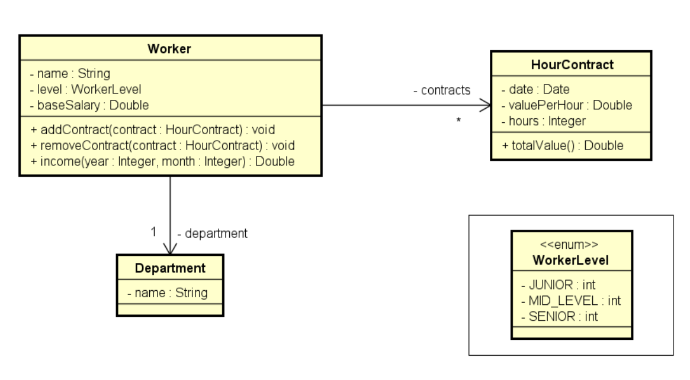

# WorkerContracts 👷‍♂️

Projeto em C# para gerenciar os contratos de um trabalhador e calcular seu ganho mensal com base nos contratos vigentes.

## 📝 Descrição

Este projeto foi desenvolvido como um exercício para praticar conceitos de composição e enumerações em C# e para resolver o seguinte problema:

> Ler os dados de um trabalhador com N contratos (N fornecido pelo usuário). Depois, solicitar do usuário um mês e mostrar qual foi o salário do funcionário nesse mês.

## 📚 Resolução do Professor

Este exercício foi proposto pelo professor Nélio Alves em seu curso de C#. A resolução completa do professor pode ser encontrada no seguinte repositório:

- [composition1-csharp](https://github.com/acenelio/composition1-csharp)

##  UML - Diagrama de Classe

O diagrama abaixo representa a estrutura de classes do projeto, mostrando a relação entre o Trabalhador (`Worker`), seus Contratos (`HourContract`) e o Departamento (`Department`).



## 🚀 Como Rodar o Projeto

### Pré-requisitos

- [.NET SDK](https://dotnet.microsoft.com/download) instalado em sua máquina.

### Passos

1.  **Clone o repositório:**
  ```bash
  git clone https://github.com/ericssendelima/projetos-estudos-csharp.git
  ```

2.  **Navegue até a pasta do projeto:**
  ```bash
  cd Composicoes-Enums/WorkerContracts
  ```

3.  **Execute a aplicação:**
  ```bash
  dotnet run
  ```

## 💻 Exemplo de Uso

A seguir, um exemplo de interação com o programa via console:

```
Enter department's name: Design
Enter worker data:
Name: Alex
Level (Junior/MidLevel/Senior): MidLevel
Base salary: 1200.00
How many contracts to this worker? 3

Enter contract #1 data:
Date (DD/MM/YYYY): 20/08/2023
Value per hour: 50.00
Duration (hours): 20

Enter contract #2 data:
Date (DD/MM/YYYY): 13/06/2023
Value per hour: 30.00
Duration (hours): 18

Enter contract #3 data:
Date (DD/MM/YYYY): 25/08/2023
Value per hour: 80.00
Duration (hours): 10

Enter month and year to calculate income (MM/YYYY): 08/2023
Name: Alex
Department: Design
Income for 08/2023: 3000.00
```
