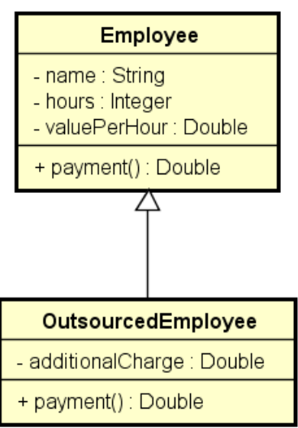

# Employees Payments

Este projeto é uma solução para o exercício proposto no capítulo de Herança e Polimorfismo do curso de C#.

## Enunciado do Exercício

Uma empresa possui funcionários próprios e terceirizados.
Para cada funcionário, deseja-se registrar nome, horas trabalhadas e valor por hora. Funcionários terceirizados possuem ainda uma despesa adicional.

O pagamento dos funcionários corresponde ao valor da hora multiplicado pelas horas trabalhadas, sendo que os funcionários terceirizados ainda recebem um bônus correspondente a 110% de sua despesa adicional.

Fazer um programa para ler os dados de N funcionários (N fornecido pelo usuário) e armazená-los em uma lista. Depois de ler todos os dados, mostrar nome e pagamento de cada funcionário na mesma ordem em que foram digitados.

## Diagrama de Classes



## Exemplo de Uso

A seguir, um exemplo da execução do programa, mostrando a entrada de dados e a saída gerada.

**Entrada:**
```
Enter the number of employees: 3
Employee #1 data:
Outsourced (y/n)? y
Name: Alex
Hours: 100
Value per hour: 50.00
Additional charge: 200.00
Employee #2 data:
Outsourced (y/n)? n
Name: Bob
Hours: 100
Value per hour: 30.00
Employee #3 data:
Outsourced (y/n)? y
Name: Maria
Hours: 60
Value per hour: 50.00
Additional charge: 500.00
```

**Saída:**
```
PAYMENTS:
Alex - $ 5220.00
Bob - $ 3000.00
Maria - $ 3550.00
```

## Como Rodar o Projeto

1.  Clone este repositório:
  ```bash
  git clone <URL_DO_REPOSITORIO>
  ```
2.  Navegue até a pasta do projeto:
  ```bash
  cd Heranca-e-polimorfismo/EmployeesPayments
  ```
3.  Execute o comando para rodar a aplicação:
  ```bash
  dotnet run
  ```

## Solução do Professor

Para referência, a solução original do professor pode ser encontrada no seguinte repositório:
[inheritance4-csharp](https://github.com/acenelio/inheritance4-csharp)

