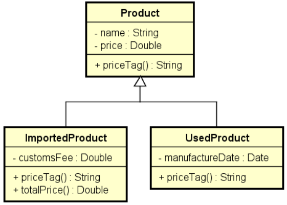

# Products Details

## Descrição do Projeto

Este projeto é uma solução para um exercício de fixação em C# que aborda os conceitos de Herança e Polimorfismo.

### Enunciado

Fazer um programa para ler os dados de N produtos (N fornecido pelo usuário). Ao final, mostrar a etiqueta de preço de cada produto na mesma ordem em que foram digitados.

-   Todo produto possui nome e preço.
-   Produtos importados possuem uma taxa de alfândega.
-   Produtos usados possuem data de fabricação.

Estes dados específicos devem ser acrescentados na etiqueta de preço. Para produtos importados, a taxa de alfândega deve ser acrescentada ao preço final do produto.

## Exemplo de Uso

```bash
Enter the number of products: 3
Product #1 data:
Common, used or imported (c/u/i)? i
Name: Tablet
Price: 260.00
Customs fee: 20.00
Product #2 data:
Common, used or imported (c/u/i)? c
Name: Notebook
Price: 1100.00
Product #3 data:
Common, used or imported (c/u/i)? u
Name: Iphone
Price: 400.00
Manufacture date (DD/MM/YYYY): 15/03/2017

PRICE TAGS:
Tablet $ 280.00 (Customs fee: $ 20.00)
Notebook $ 1100.00
Iphone (used) $ 400.00 (Manufacture date: 15/03/2017)
```

## Diagrama de Classes



## Como Rodar o Projeto

1.  Clone o repositório.
2.  Abra o terminal na pasta do projeto.
3.  Execute o comando:
  ```bash
  dotnet run
  ```

## Resolução do Professor

A resolução original proposta pelo professor Nélio Alves pode ser encontrada no seguinte repositório:
[https://github.com/acenelio/inheritance5-csharp](https://github.com/acenelio/inheritance5-csharp)