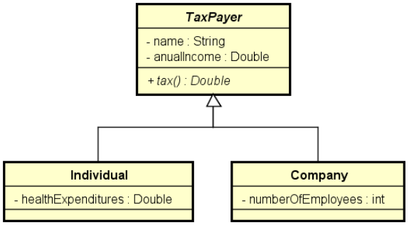

# Coleta de Impostos (Tax Collection)

Este projeto em C# é uma solução para um exercício de programação orientada a objetos, focando em herança e polimorfismo para calcular impostos de diferentes tipos de contribuintes (pessoa física e jurídica).

## Problema Proposto

Fazer um programa para ler os dados de N contribuintes (N fornecido pelo usuário), os quais podem ser pessoa física ou pessoa jurídica, e depois mostrar o valor do imposto pago por cada um, bem como o total de imposto arrecadado.

### Dados do Contribuinte

*   **Pessoa Física:** Nome, renda anual e gastos com saúde.
*   **Pessoa Jurídica:** Nome, renda anual e número de funcionários.

### Regras de Cálculo de Imposto

*   **Pessoa Física:**
  *   Renda < R$ 20.000,00: imposto de 15%.
  *   Renda >= R$ 20.000,00: imposto de 25%.
  *   Se houver gastos com saúde, 50% desses gastos são abatidos do imposto.
  *   *Exemplo:* Renda de R$ 50.000,00 e R$ 2.000,00 em saúde. Imposto: (50000 * 25%) - (2000 * 50%) = R$ 11.500,00.

*   **Pessoa Jurídica:**
  *   Até 10 funcionários: imposto de 16%.
  *   Mais de 10 funcionários: imposto de 14%.
  *   *Exemplo:* Renda de R$ 400.000,00 e 25 funcionários. Imposto: 400000 * 14% = R$ 56.000,00.

## Diagrama de Classe



## Como Executar o Projeto

1.  Certifique-se de ter o [.NET SDK](https://dotnet.microsoft.com/download) instalado.
2.  Clone o repositório.
3.  Navegue até o diretório do projeto pelo terminal.
4.  Execute o comando:
  ```bash
  dotnet run
  ```

## Exemplo de Uso

```
Enter the number of tax payers: 3
Tax payer #1 data:
Individual or company (i/c)? i
Name: Alex
Anual income: 50000.00
Health expenditures: 2000.00
Tax payer #2 data:
Individual or company (i/c)? c
Name: SoftTech
Anual income: 400000.00
Number of employees: 25
Tax payer #3 data:
Individual or company (i/c)? i
Name: Bob
Anual income: 120000.00
Health expenditures: 1000.00

TAXES PAID:
Alex: $ 11500.00
SoftTech: $ 56000.00
Bob: $ 29500.00

TOTAL TAXES: $ 97000.00
```

## Resolução do Professor

Este projeto foi desenvolvido com base no exercício proposto pelo professor Nélio Alves. A resolução original pode ser encontrada no link abaixo:

*   [inheritance8-csharp](https://github.com/acenelio/inheritance8-csharp)