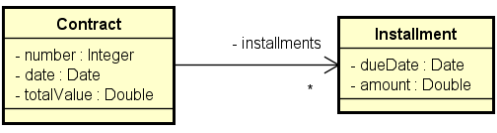
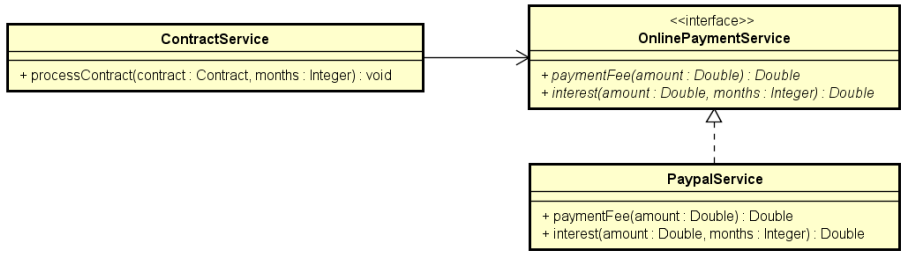

# ContractSlicer

Este projeto é uma solução em C# para um problema de processamento de contratos e geração de parcelas, utilizando interfaces para desacoplar o serviço de pagamento.

## Descrição do Problema

Uma empresa deseja automatizar o processamento de seus contratos. O processamento de um contrato consiste em gerar as parcelas a serem pagas para aquele contrato, com base no número de meses desejado.

A empresa utiliza um serviço de pagamento online para realizar o pagamento das parcelas. Os serviços de pagamento online tipicamente cobram uns juros mensais, bem como uma taxa por pagamento. Por enquanto, o serviço contratado pela empresa é o do Paypal, que aplica juros simples de 1% a cada parcela(acumula a cada mês que passa, adicionando 1% sobre o valor da parcela anterior), mais uma taxa de pagamento de 2%.

O objetivo é criar um programa para ler os dados de um contrato (número do contrato, data do contrato, e valor total do contrato). Em seguida, o programa deve ler o número de meses para parcelamento do contrato, e daí gerar os registros de parcelas a serem pagas (data e valor), sendo a primeira parcela a ser paga um mês após a data do contrato, a segunda parcela dois meses após o contrato e assim por diante. Por fim, o programa deve mostrar os dados das parcelas na tela.

## Exemplo de Uso

```
Enter contract data
Number: 8028
Date (dd/MM/yyyy): 25/06/2018
Contract value: 600.00
Enter number of installments: 3
Installments:
25/07/2018 - 206.04
25/08/2018 - 208.08
25/09/2018 - 210.12
```

## Como Executar

1.  Clone o repositório para sua máquina local.
2.  Navegue até o diretório do projeto via terminal.
3.  Execute o seguinte comando para compilar e rodar a aplicação:

  ```bash
  dotnet run
  ```

4.  Siga as instruções no console para inserir os dados do contrato.

## Diagramas de Classe

### Camada de Domínio (Domain Layer)



### Camada de Serviço (Service Layer)



## Resolução de Referência

Segue o link da solução proposta pelo professor Nelio Alves, disponível no seguinte repositório:

-   [acenelio/interfaces4-csharp](https://github.com/acenelio/interfaces4-csharp)
